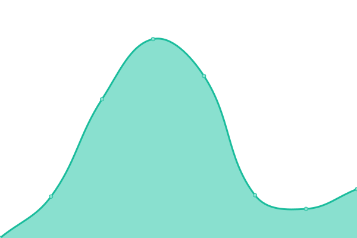
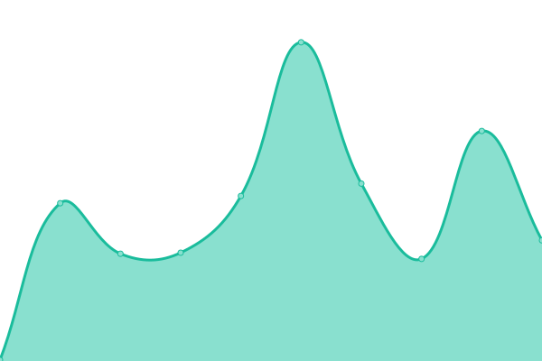
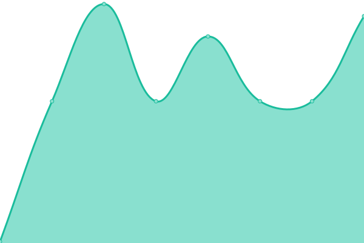

# [📈 Live Status](https://legtvar.github.io/kafe-status): <!--live status--> **🟩 All systems operational**

<!--start: status pages-->
<!-- This summary is generated by Upptime (https://github.com/upptime/upptime) -->
<!-- Do not edit this manually, your changes will be overwritten -->
<!-- prettier-ignore -->
| URL | Status | History | Response Time | Uptime |
| --- | ------ | ------- | ------------- | ------ |
|  [Kafe](http://kafe.fi.muni.cz/) | 🟩 Up | [kafe.yml](https://github.com/legtvar/kafe-status/commits/HEAD/history/kafe.yml) | 

 984ms
     
 | 

<a href="https://legtvar.github.io/kafe-status/history/kafe">99.68%</a>
    

|  [Kafe - API](https://kafe.fi.muni.cz/swagger/index.html) | 🟩 Up | [kafe-api.yml](https://github.com/legtvar/kafe-status/commits/HEAD/history/kafe-api.yml) | 

 125ms
     
 | 

<a href="https://legtvar.github.io/kafe-status/history/kafe-api">99.68%</a>
    

|  [Garrigue Games](https://games.muni.cz) | 🟩 Up | [garrigue-games.yml](https://github.com/legtvar/kafe-status/commits/HEAD/history/garrigue-games.yml) | 

 674ms
     
 | 

<a href="https://legtvar.github.io/kafe-status/history/garrigue-games">99.68%</a>
    

|  [Garrigue Games - API](https://games.muni.cz/api/v1/games) | 🟩 Up | [garrigue-games-api.yml](https://github.com/legtvar/kafe-status/commits/HEAD/history/garrigue-games-api.yml) | 

 122ms
     
 | 

<a href="https://legtvar.github.io/kafe-status/history/garrigue-games-api">99.69%</a>
    

<!--end: status pages-->

[**Visit our status website →**](https://legtvar.github.io/kafe-status)

## 📄 License

- Powered by: [Upptime](https://github.com/upptime/upptime)
- Code: [MIT](./LICENSE) © [Anand Chowdhary](https://anandchowdhary.com), supported by [Pabio](https://pabio.com)
- Data in the `./history` directory: [Open Database License](https://opendatacommons.org/licenses/odbl/1-0/)
